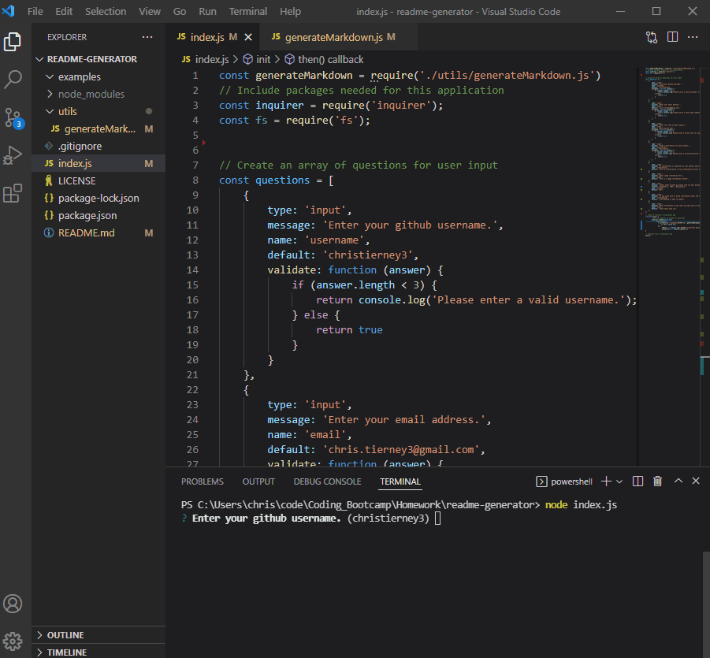

## README Generator

## License description: (https://opensource.org/licenses/MIT)

## Description:
All README files should be a painless addition to your hard work in developing your project, while looking professional and detailing your work. With this README generator the user is able to easily add a README file to their project without the hassle of typing it all out. By filling out some questions/fields using node the layout for your README is generated with ease!

## Table of Contents
* [Description](#description)
* [Installtion](#installation)
* [Usage Info](#usage)
* [Contributions](#contributing)
* [Testing](#tests)
* [Questions](#questions)

## Installation: 
For this to run you will need to install inquirer through node. (npm i inquirer)

## Usage: 
With inquirer installed run node index.js to fill out a form detailing what you would like in certain sections of the README.

## Contributions: 
Contributing is open to anyone!

## Questions:
If you have any questions please contact me at chris.tierney3@gmail.com or https://github.com/christierney3

